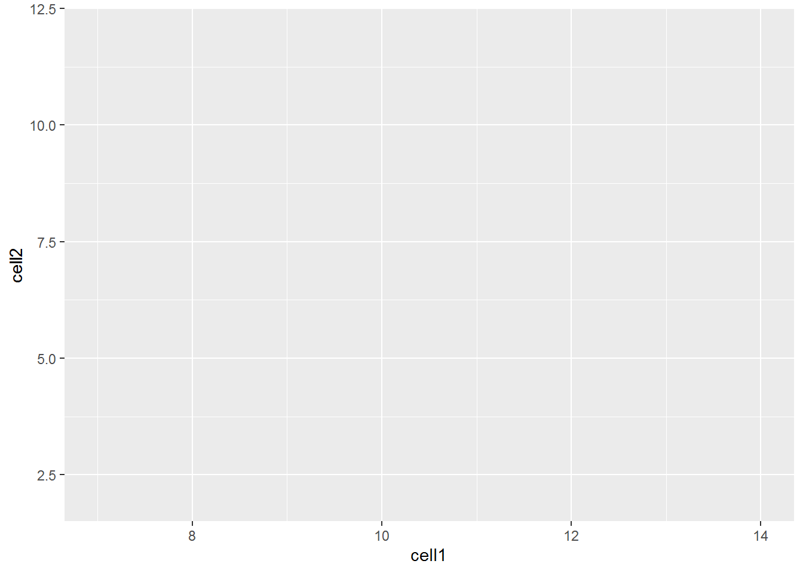
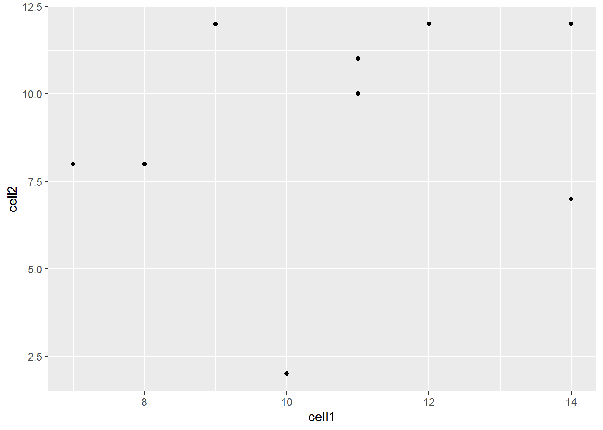

# R/Bioconductor介绍 {#intro_r_bioc}

## 安装R包

### CRAN

The Comprehensive R Archive Network [CRAN](https://cran.r-project.org/) 是最大的R包库。除了成功build和安装之外，对上传R包要求很少，因此文档和相关支持通常很少，弄清楚如何使用这些R包本身成为一个挑战。CRAN是R搜索安装R包的默认库：


```r
install.packages("devtools")
require("devtools")
```

### Github

[Github](https://github.com/) 并不特定于R，任何状态的任何类型的代码都可以上传。但无法保证上传到github的软件包可以安装，也不保证它声称做的事情。可以使用上述安装的“devtools”软件包直接从github下载和安装R软件包。


```r
devtools::install_github("tallulandrews/M3Drop")
```

Github同时也是一个版本控制系统，可以存储任何软件包的多个版本。默认情况下，会安装最新的“master”版本的软件包。如果您想使用旧版本或开发分支，可以使用“ref”参数指定：


```r
# different branch
devtools::install_github("tallulandrews/M3D", ref="nbumi")
# previous commit
devtools::install_github("tallulandrews/M3Drop", ref="434d2da28254acc8de4940c1dc3907ac72973135")
```
注意: 确保重新安装M3Drop master分支以便后续课堂使用。

### Bioconductor
Bioconductor是专门用于生物分析的R包库。它对提交有最严格的要求，包括在各平台上安装，以及完整的文档和教程（称为vignette），解释如何使用包。Bioconductor还鼓励使用标准数据结构/类。


```r
source("https://bioconductor.org/biocLite.R")
biocLite("edgeR")
```

注意: 某些情况下有必要将上述的"http://" 替换为 "https://" ,这取决于网络连接的安全属性。

Bioconductor还要求作者维护他们的R包，并定期6个月发布更新。 在尝试安装课程所需R包之前，请确保使用最新版本的bioconductor。


```r
source("https://bioconductor.org/biocLite.R")
biocLite("BiocUpgrade")
```

### 源码安装
安装包的最后一种方法是直接从源码安装。 在这种情况下，必须下载完整构建的源代码文件，通常是packagename.tar.gz，或克隆github仓并重新build软件包。通常，只有在编辑包或者由于某种原因前一种方法失败时才会这样做。


```r
install.packages("M3Drop_3.05.00.tar.gz", type="source")
```

## 安装说明:
本课程所需的所有软件包都可以在[这里](https://github.com/hemberg-lab/scRNA.seq.course/blob/master/Dockerfile)获得。从"RUN Rscript -e "install.packages('devtools')" "开始，在命令行或者R session运行引号内的命令(移除"RUN")。注意，某些情况下安装顺序也很重要，请确保按顺序执行。

## 数据类型/类

R是一种高级语言，因此底层数据类型通常并不重要。 如果您使用其他语言（如C）直接访问R数据，则需要考虑，但这超出了本课程的范围。 相反，我们将考虑基本数据类型：数值(numeric)，整数(integer)，逻辑(logical)和字符(character)，以及高级数据类“因子”。 使用“class（）”函数检查数据的类型。

除此之外：R还可以将数据存储为“复数(complex)”，但通常这与生物分析无关。

### 数值

“数值”类型是存储任何数值数据的默认类 - 整数，十进制数，科学计数法中的数字等...


```r
x = 1.141
class(x)
```

```
## [1] "numeric"
```

```r
y = 42
class(y)
```

```
## [1] "numeric"
```

```r
z = 6.02e23
class(z)
```

```
## [1] "numeric"
```

即使R有一个“整数”类型，42可以更有效地存储为整数，默认是将其存储为“数值”类型。 如果我们想要将42存储为整数，我们必须`强制`类型转换：


```r
y = as.integer(42)
class(y)
```

```
## [1] "integer"
```

强制R将数据存储为特定类，如果我们的数据与该类不兼容，它仍将执行此操作，但数据将转换为NA：


```r
as.numeric("H")
```

```
## Warning: 强制改变过程中产生了NA
```

```
## [1] NA
```

上述将“字符”数据强制转换为无意义的数值，因此触发（“抛出”）警告消息。 由于这只是一个警告信息，R将继续执行脚本/函数中的后续命令，而“错误”将导致R停止执行。

### 字符/字符串

“character”类型存储各种文本数据。 编程约定将包含多个字母的数据称为“字符串”，因此大多数作用于字符数据的R函数将数据称为“字符串”，并且通常在其名称中包含“str”或“string”。字符串通过双引号标识，而变量/函数名称则不是：


```r
x = 5

a = "x" # character "x"
a
```

```
## [1] "x"
```

```r
b = x # variable x
b
```

```
## [1] 5
```

In addition to standard alphanumeric characters, strings can also store various special characters. Special characters are identified using a backlash followed by a single character, the most relevant are the special character for tab : `\t` and new line : `\n`. To demonstrate the these special characters lets concatenate (cat) together two strings with these characters separating (sep) them:

```r
cat("Hello", "World", sep= " ")
```

```
## Hello World
```

```r
cat("Hello", "World", sep= "\t")
```

```
## Hello	World
```

```r
cat("Hello", "World", sep= "\n")
```

```
## Hello
## World
```
Note that special characters work differently in different functions. For instance the `paste` function does the same thing as `cat` but does not recognize special characters.


```r
paste("Hello", "World", sep= " ")
```

```
## [1] "Hello World"
```

```r
paste("Hello", "World", sep= "\t")
```

```
## [1] "Hello\tWorld"
```

```r
paste("Hello", "World", sep= "\n")
```

```
## [1] "Hello\nWorld"
```

Single or double backslash is also used as an `escape` character to turn off special characters or allow quotation marks to be included in strings:


```r
cat("This \"string\" contains quotation marks.")
```

```
## This "string" contains quotation marks.
```

Special characters are generally only used in pattern matching, and reading/writing data to files. For instance this is how you would read a tab-separated file into R.

```r
dat = read.delim("file.tsv", sep="\t")
```

Another special type of character data are colours. Colours can be specified in three main ways: by name from those [available](http://bxhorn.com/r-color-tables/), by red, green, blue values using the `rgb` function, and by hue (colour), saturation (colour vs white) and value (colour/white vs black) using the `hsv` function. By default rgb and hsv expect three values in 0-1 with an optional fourth value for transparency. Alternatively, sets of predetermined colours with useful properties can be loaded from many different packages with [RColorBrewer](http://colorbrewer2.org/) being one of the most popular.


```r
reds = c("red", rgb(1,0,0), hsv(0, 1, 1))
reds
```

```
## [1] "red"     "#FF0000" "#FF0000"
```

```r
barplot(c(1,1,1), col=reds, names=c("by_name", "by_rgb", "by_hsv"))
```


### Logical

The `logical` class stores boolean truth values, i.e. TRUE and FALSE. It is used for storing the results of logical operations and conditional statements will be coerced to this class. Most other data-types can be coerced to boolean without triggering (or "throwing") error messages, which may cause unexpected behaviour.


```r
x = TRUE
class(x)
```

```
## [1] "logical"
```

```r
y = "T"
as.logical(y)
```

```
## [1] TRUE
```

```r
z = 5
as.logical(z)
```

```
## [1] TRUE
```

```r
x = FALSE
class(x)
```

```
## [1] "logical"
```

```r
y = "F"
as.logical(y)
```

```
## [1] FALSE
```

```r
z = 0
as.logical(z)
```

```
## [1] FALSE
```
__Exercise 1__
Experiment with other character and numeric values, which are coerced to TRUE or FALSE? which are coerced to neither? 
Do you ever throw a warning/error message?

### Factors

String/Character data is very memory inefficient to store, each letter generally requires the same amount of memory as any integer. Thus when storing a vector of strings with repeated elements it is more efficient assign each element to an integer and store the vector as integers and an additional string-to-integer association table. Thus, by default R will read in text columns of a data table as factors. 


```r
str_vector = c("Apple", "Apple", "Banana", "Banana", "Banana", "Carrot", "Carrot", "Apple", "Banana") 
factored_vector = factor(str_vector)
factored_vector
```

```
## [1] Apple  Apple  Banana Banana Banana Carrot Carrot Apple  Banana
## Levels: Apple Banana Carrot
```

```r
as.numeric(factored_vector)
```

```
## [1] 1 1 2 2 2 3 3 1 2
```

The double nature of factors can cause some unintuitive behaviour. E.g. joining two factors together will convert them to the numeric form and the original strings will be lost.


```r
c(factored_vector, factored_vector)
```

```
##  [1] 1 1 2 2 2 3 3 1 2 1 1 2 2 2 3 3 1 2
```

Likewise if due to formatting issues numeric data is mistakenly interpretted as strings, then you must convert the factor back to strings before coercing to numeric values:

```r
x = c("20", "25", "23", "38", "20", "40", "25", "30")
x = factor(x)
as.numeric(x)
```

```
## [1] 1 3 2 5 1 6 3 4
```

```r
as.numeric(as.character(x))
```

```
## [1] 20 25 23 38 20 40 25 30
```

To make R read text as character data instead of factors set the environment option `stringsAsFactors=FALSE`. This must be done at the start of each R session.


```r
options(stringsAsFactors=FALSE)
```
__Exercise__
How would you use factors to create a vector of colours for an arbitrarily long vector of fruits like `str_vector` above?
__Answer__


### Checking class/type
We recommend checking your data is of the correct class after reading from files:


```r
x = 1.4
is.numeric(x)
```

```
## [1] TRUE
```

```r
is.character(x)
```

```
## [1] FALSE
```

```r
is.logical(x)
```

```
## [1] FALSE
```

```r
is.factor(x)
```

```
## [1] FALSE
```


## Basic data structures
So far we have only looked at single values and vectors. Vectors are the simplest data structure in R. They are a 1-dimensional array of data all of the same type. If the input when creating a vector is of different types it will be coerced to the data-type that is most consistent with the data.


```r
x = c("Hello", 5, TRUE)
x
```

```
## [1] "Hello" "5"     "TRUE"
```

```r
class(x)
```

```
## [1] "character"
```
Here we tried to put character, numeric and logical data into a single vector so all the values were coerced to `character` data.

A `matrix` is the two dimensional version of a vector, it also requires all data to be of the same type. 
If we combine a character vector and a numeric vector into a matrix, all the data will be coerced to characters:


```r
x = c("A", "B", "C")
y = c(1, 2, 3)
class(x)
```

```
## [1] "character"
```

```r
class(y)
```

```
## [1] "numeric"
```

```r
m = cbind(x, y)
m
```

```
##      x   y  
## [1,] "A" "1"
## [2,] "B" "2"
## [3,] "C" "3"
```

The quotation marks indicate that the numeric vector has been coerced to characters. Alternatively, to store data with columns of different data-types we can use a dataframe.


```r
z = data.frame(x, y)
z
```

```
##   x y
## 1 A 1
## 2 B 2
## 3 C 3
```

```r
class(z[,1])
```

```
## [1] "character"
```

```r
class(z[,2])
```

```
## [1] "numeric"
```

If you have set stringsAsFactors=FALSE as above you will find the first column remains characters, otherwise it will be automatically converted to a factor.


```r
options(stringsAsFactors=TRUE)
z = data.frame(x, y)
class(z[,1])
```

```
## [1] "factor"
```

Another difference between matrices and dataframes is the ability to select columns using the `$` operator:


```r
m$x # throws an error
z$x # ok
```

The final basic data structure is the `list`. Lists allow data of different types and different lengths to be stored in a single object. Each element of a list can be any other R object : data of any type, any data structure, even other lists or functions. 


```r
l = list(m, z)
ll = list(sublist=l, a_matrix=m, numeric_value=42, this_string="Hello World", even_a_function=cbind)
ll
```

```
## $sublist
## $sublist[[1]]
##      x   y  
## [1,] "A" "1"
## [2,] "B" "2"
## [3,] "C" "3"
## 
## $sublist[[2]]
##   x y
## 1 A 1
## 2 B 2
## 3 C 3
## 
## 
## $a_matrix
##      x   y  
## [1,] "A" "1"
## [2,] "B" "2"
## [3,] "C" "3"
## 
## $numeric_value
## [1] 42
## 
## $this_string
## [1] "Hello World"
## 
## $even_a_function
## function (..., deparse.level = 1) 
## .Internal(cbind(deparse.level, ...))
## <bytecode: 0x0000000008278de8>
## <environment: namespace:base>
```

Lists are most commonly used when returning a large number of results from a function that do not fit into any of the previous data structures. 

## More information

You can get more information about any R commands relevant to these datatypes using by typing `?function` in an interactive session.

## Data Types

### What is Tidy Data?

Tidy data is a concept largely defined by Hadley Wickham [@wickham_2014]. Tidy data has the following three characteristics:

1. Each variable has its own column.
2. Each observation has its own row.
3. Each value has its own cell.

Here is an example of some tidy data:

```
##   Students   Subject Years Score
## 1     Mark     Maths     1     5
## 2     Jane   Biology     2     6
## 3 Mohammed   Physics     3     4
## 4      Tom     Maths     2     7
## 5    Celia Computing     3     9
```

Here is an example of some untidy data:

```
##    Students    Sport Category Counts
## 1      Matt   Tennis     Wins      0
## 2      Matt   Tennis   Losses      1
## 3     Ellie    Rugby     Wins      3
## 4     Ellie    Rugby   Losses      2
## 5       Tim Football     Wins      1
## 6       Tim Football   Losses      4
## 7    Louise Swimming     Wins      2
## 8    Louise Swimming   Losses      2
## 9     Kelly  Running     Wins      5
## 10    Kelly  Running   Losses      1
```

Task 1: In what ways is the untidy data not tidy? How could we make the untidy data tidy?

Tidy data is generally easier to work with than untidy data, especially if you are working with packages such as ggplot. Fortunately, packages are available to make untidy data tidy. Today we will explore a few of the functions available in the tidyr package which can be used to make untidy data tidy. If you are interested in finding out more about tidying data, we recommend reading "R for Data Science", by Garrett Grolemund and Hadley Wickham. An electronic copy is available here: http://r4ds.had.co.nz/

The untidy data above is untidy because two variables (`Wins` and `Losses`) are stored in one column (`Category`). This is a common way in which data can be untidy. To tidy this data, we need to make `Wins` and `Losses` into columns, and store the values in `Counts` in these columns. Fortunately, there is a function from the tidyverse packages to perform this operation. The function is called `spread`, and it takes two arguments, `key` and `value`. You should pass the name of the column which contains multiple variables to `key`, and pass the name of the column which contains values from multiple variables to `value`. For example:


```r
library(tidyverse)
sports<-data.frame(Students=c("Matt", "Matt", "Ellie", "Ellie", "Tim", "Tim", "Louise", "Louise", "Kelly", "Kelly"), Sport=c("Tennis","Tennis", "Rugby", "Rugby","Football", "Football","Swimming","Swimming", "Running", "Running"), Category=c("Wins", "Losses", "Wins", "Losses", "Wins", "Losses", "Wins", "Losses", "Wins", "Losses"), Counts=c(0,1,3,2,1,4,2,2,5,1))
sports
```

```
##    Students    Sport Category Counts
## 1      Matt   Tennis     Wins      0
## 2      Matt   Tennis   Losses      1
## 3     Ellie    Rugby     Wins      3
## 4     Ellie    Rugby   Losses      2
## 5       Tim Football     Wins      1
## 6       Tim Football   Losses      4
## 7    Louise Swimming     Wins      2
## 8    Louise Swimming   Losses      2
## 9     Kelly  Running     Wins      5
## 10    Kelly  Running   Losses      1
```

```r
spread(sports, key=Category, value=Counts)
```

```
##   Students    Sport Losses Wins
## 1    Ellie    Rugby      2    3
## 2    Kelly  Running      1    5
## 3   Louise Swimming      2    2
## 4     Matt   Tennis      1    0
## 5      Tim Football      4    1
```

Task 2: The dataframe `foods` defined below is untidy. Work out why and use `spread()` to tidy it


```r
foods<-data.frame(student=c("Antoinette","Antoinette","Taylor", "Taylor", "Alexa", "Alexa"), Category=c("Dinner", "Dessert", "Dinner", "Dessert", "Dinner","Dessert"), Frequency=c(3,1,4,5,2,1))
```

The other common way in which data can be untidy is if the columns are values instead of variables. For example, the dataframe below shows the percentages some students got in tests they did in May and June. The data is untidy because the columns `May` and `June` are values, not variables.


```r
percentages<-data.frame(student=c("Alejandro", "Pietro", "Jane"), "May"=c(90,12,45), "June"=c(80,30,100))
```

Fortunately, there is a function in the tidyverse packages to deal with this problem too. `gather()` takes the names of the columns which are values, the `key` and the `value` as arguments. This time, the `key` is the name of the variable with values as column names, and the `value` is the name of the variable with values spread over multiple columns. Ie:


```r
gather(percentages, "May", "June", key="Month", value = "Percentage")
```

```
##     student Month Percentage
## 1 Alejandro   May         90
## 2    Pietro   May         12
## 3      Jane   May         45
## 4 Alejandro  June         80
## 5    Pietro  June         30
## 6      Jane  June        100
```

These examples don't have much to do with single-cell RNA-seq analysis, but are designed to help illustrate the features of tidy and untidy data. You will find it much easier to analyse your single-cell RNA-seq data if your data is stored in a tidy format. Fortunately, the data structures we commonly use to facilitate single-cell RNA-seq analysis usually encourage store your data in a tidy manner.

### What is Rich Data?

If you google 'rich data', you will find lots of different definitions for this term. In this course, we will use 'rich data' to mean data which is generated by combining information from multiple sources. For example, you could make rich data by creating an object in R which contains a matrix of gene expression values across the cells in your single-cell RNA-seq experiment, but also information about how the experiment was performed. Objects of the `SingleCellExperiment` class, which we will discuss below, are an example of rich data.


---
output: html_document
---

## Bioconductor, `SingleCellExperiment` and `scater`


### Bioconductor

From [Wikipedia](https://en.wikipedia.org/wiki/Bioconductor):
[Bioconductor](https://www.bioconductor.org/) is a free, open source and open development software project for the analysis and comprehension of genomic data generated by wet lab experiments in molecular biology. Bioconductor is based primarily on the statistical R programming language, but does contain contributions in other programming languages. It has two releases each year that follow the semiannual releases of R. At any one time there is a release version, which corresponds to the released version of R, and a development version, which corresponds to the development version of R. Most users will find the release version appropriate for their needs.

We strongly recommend all new comers and even experienced high-throughput data analysts to use well developed and maintained [Bioconductor methods and classes](https://www.bioconductor.org/developers/how-to/commonMethodsAndClasses/).

### `SingleCellExperiment` class

[`SingleCellExperiment`](http://bioconductor.org/packages/SingleCellExperiment) (SCE) is a S4 class for storing data from single-cell experiments. This includes specialized methods to store and retrieve spike-in information, dimensionality reduction coordinates and size factors for each cell, along with the usual metadata for genes and libraries.

In practice, an object of this class can be created using its constructor:

```r
library(SingleCellExperiment)
counts <- matrix(rpois(100, lambda = 10), ncol=10, nrow=10)
rownames(counts) <- paste("gene", 1:10, sep = "")
colnames(counts) <- paste("cell", 1:10, sep = "")
sce <- SingleCellExperiment(
    assays = list(counts = counts),
    rowData = data.frame(gene_names = paste("gene_name", 1:10, sep = "")),
    colData = data.frame(cell_names = paste("cell_name", 1:10, sep = ""))
)
sce
```

```
## class: SingleCellExperiment 
## dim: 10 10 
## metadata(0):
## assays(1): counts
## rownames(10): gene1 gene2 ... gene9 gene10
## rowData names(1): gene_names
## colnames(10): cell1 cell2 ... cell9 cell10
## colData names(1): cell_names
## reducedDimNames(0):
## spikeNames(0):
```

In the `SingleCellExperiment`, users can assign arbitrary names to entries of assays. To assist interoperability between packages, some suggestions for what the names should be for particular types of data are provided by the authors:

* __counts__: Raw count data, e.g., number of reads or transcripts for a particular gene.
* __normcounts__: Normalized values on the same scale as the original counts. For example, counts divided by cell-specific size factors that are centred at unity.
* __logcounts__: Log-transformed counts or count-like values. In most cases, this will be defined as log-transformed normcounts, e.g., using log base 2 and a pseudo-count of 1.
* __cpm__: Counts-per-million. This is the read count for each gene in each cell, divided by the library size of each cell in millions.
* __tpm__: Transcripts-per-million. This is the number of transcripts for each gene in each cell, divided by the total number of transcripts in that cell (in millions).

Each of these suggested names has an appropriate getter/setter method for convenient manipulation of the `SingleCellExperiment`. For example, we can take the (very specifically named) `counts` slot, normalise it and assign it to `normcounts` instead:


```r
normcounts(sce) <- log2(counts(sce) + 1)
sce
```

```
## class: SingleCellExperiment 
## dim: 10 10 
## metadata(0):
## assays(2): counts normcounts
## rownames(10): gene1 gene2 ... gene9 gene10
## rowData names(1): gene_names
## colnames(10): cell1 cell2 ... cell9 cell10
## colData names(1): cell_names
## reducedDimNames(0):
## spikeNames(0):
```

```r
dim(normcounts(sce))
```

```
## [1] 10 10
```

```r
head(normcounts(sce))
```

```
##          cell1    cell2    cell3    cell4    cell5    cell6    cell7
## gene1 3.169925 3.169925 2.000000 2.584963 2.584963 3.321928 3.584963
## gene2 3.459432 1.584963 3.584963 3.807355 3.700440 3.700440 3.000000
## gene3 3.000000 3.169925 3.807355 3.169925 3.321928 3.321928 3.321928
## gene4 3.584963 3.459432 3.000000 3.807355 3.700440 3.700440 3.700440
## gene5 3.906891 3.000000 3.169925 3.321928 3.584963 3.459432 3.807355
## gene6 3.700440 3.700440 3.584963 4.000000 3.169925 3.000000 3.459432
##          cell8    cell9   cell10
## gene1 3.321928 3.807355 2.807355
## gene2 3.807355 3.700440 4.000000
## gene3 2.584963 4.000000 3.700440
## gene4 3.169925 3.584963 3.700440
## gene5 3.807355 2.584963 3.584963
## gene6 3.321928 3.459432 4.000000
```

### `scater` package

[`scater`](http://bioconductor.org/packages/scater/) is a R package for single-cell RNA-seq analysis [@McCarthy2017-kb]. The package contains several useful methods for quality control, visualisation and pre-processing of data prior to further downstream analysis.

`scater` features the following functionality:

* Automated computation of QC metrics
* Transcript quantification from read data with pseudo-alignment
* Data format standardisation
* Rich visualizations for exploratory analysis
* Seamless integration into the Bioconductor universe
* Simple normalisation methods

We highly recommend to use `scater` for all single-cell RNA-seq analyses and `scater` is the basis of the first part of the course.

As illustrated in the figure below, `scater` will help you with quality control, filtering and normalization of your expression matrix following mapping and alignment. <span style="color:red">Keep in mind that this figure represents the original version of `scater` where an `SCESet` class was used. In the newest version this figure is still correct, except that `SCESet` can be substituted with the `SingleCellExperiment` class.</span>


## An Introduction to ggplot2

### What is ggplot2?

ggplot2 is an R package designed by Hadley Wickham which facilitates data plotting. In this lab, we will touch briefly on some of the features of the package. If you would like to learn more about how to use ggplot2, we would recommend reading "ggplot2 Elegant graphics for data analysis", by Hadley Wickham.


### Principles of ggplot2

* Your data must be a dataframe if you want to plot it using ggplot2. 
* Use the `aes` mapping function to specify how variables in the dataframe map to features on your plot
* Use geoms to specify how your data should be represented on your graph eg. as a scatterplot, a barplot, a boxplot etc.

### Using the `aes` mapping function

The `aes` function specifies how variables in your dataframe map to features on your plot. To understand how this works, let's look at an example:


```r
library(ggplot2)
library(tidyverse)
set.seed(1)
counts <- as.data.frame(matrix(rpois(100, lambda = 10), ncol=10, nrow=10))
Gene_ids <- paste("gene", 1:10, sep = "")
colnames(counts) <- paste("cell", 1:10, sep = "")
counts<-data.frame(Gene_ids, counts)
counts
```

```
##    Gene_ids cell1 cell2 cell3 cell4 cell5 cell6 cell7 cell8 cell9 cell10
## 1     gene1     8     8     3     5     5     9    11     9    13      6
## 2     gene2    10     2    11    13    12    12     7    13    12     15
## 3     gene3     7     8    13     8     9     9     9     5    15     12
## 4     gene4    11    10     7    13    12    12    12     8    11     12
## 5     gene5    14     7     8     9    11    10    13    13     5     11
## 6     gene6    12    12    11    15     8     7    10     9    10     15
## 7     gene7    11    11    14    11    11     5     9    13    13      7
## 8     gene8     9    12     9     8     6    14     7    12    12     10
## 9     gene9    14    12    11     7    10    10     8    14     7     10
## 10   gene10    11    10     9     7    11    16     8     7     7      4
```

```r
ggplot(data = counts, mapping = aes(x = cell1, y = cell2))
```



Let's take a closer look at the final command, `ggplot(data = counts, mapping = aes(x = cell1, y = cell2))`. `ggplot()` initialises a ggplot object and takes the arguments `data` and `mapping`. We pass our dataframe of counts to `data` and use the `aes()` function to specify that we would like to use the variable cell1 as our x variable and the variable cell2 as our y variable.

Task 1: Modify the command above to initialise a ggplot object where cell10 is the x variable and cell8 is the y variable.

Clearly, the plots we have just created are not very informative because no data is displayed on them. To display data, we will need to use geoms.

### Geoms

We can use geoms to specify how we would like data to be displayed on our graphs. For example, our choice of geom could specify that we would like our data to be displayed as a scatterplot, a barplot or a boxplot.

Let's see how our graph would look as a scatterplot.


```r
ggplot(data = counts, mapping = aes(x = cell1, y = cell2)) + geom_point()
```



Now we can see that there doesn't seem to be any correlation between gene expression in cell1 and cell2. Given we generated `counts` randomly, this isn't too surprising.

Task 2: Modify the command above to create a line plot. Hint: execute `?ggplot` and scroll down the help page. At the bottom is a link to the ggplot package index. Scroll through the index until you find the geom options.

### Plotting data from more than 2 cells

So far we've been considering the gene counts from 2 of the cells in our dataframe. But there are actually 10 cells in our dataframe and it would be nice to compare all of them. What if we wanted to plot data from all 10 cells at the same time?

At the moment we can't do this because we are treating each individual cell as a variable and assigning that variable to either the x or the y axis. We could create a 10 dimensional graph to plot data from all 10 cells on, but this is a) not possible to do with ggplot and b) not very easy to interpret. What we could do instead is to tidy our data so that we had one variable representing cell ID and another variable representing gene counts, and plot those against each other. In code, this would look like:


```r
counts<-gather(counts, colnames(counts)[2:11], key = 'Cell_ID', value='Counts')
head(counts)
```

```
##   Gene_ids Cell_ID Counts
## 1    gene1   cell1      8
## 2    gene2   cell1     10
## 3    gene3   cell1      7
## 4    gene4   cell1     11
## 5    gene5   cell1     14
## 6    gene6   cell1     12
```

Essentially, the problem before was that our data was not tidy because one variable (Cell_ID) was spread over multiple columns. Now that we've fixed this problem, it is much easier for us to plot data from all 10 cells on one graph.


```r
ggplot(counts,aes(x=Cell_ID, y=Counts)) + geom_boxplot()
```


Task 3: Use the updated `counts` dataframe to plot a barplot with Cell_ID as the x variable and Counts as the y variable. Hint: you may find it helpful to read `?geom_bar`.

Task 4: Use the updated `counts` dataframe to plot a scatterplot with Gene_ids as the x variable and Counts as the y variable.

### Plotting heatmaps

A common method for visualising gene expression data is with a heatmap. Here we will use the R package `pheatmap` to perform this analysis with some gene expression data we will name `test`.


```r
library(pheatmap)
```

```
## Warning: 程辑包'pheatmap'是用R版本3.5.2 来建造的
```

```r
set.seed(2)
test = matrix(rnorm(200), 20, 10)
test[1:10, seq(1, 10, 2)] = test[1:10, seq(1, 10, 2)] + 3
test[11:20, seq(2, 10, 2)] = test[11:20, seq(2, 10, 2)] + 2
test[15:20, seq(2, 10, 2)] = test[15:20, seq(2, 10, 2)] + 4
colnames(test) = paste("Cell", 1:10, sep = "")
rownames(test) = paste("Gene", 1:20, sep = "")
pheatmap(test)
```


Let's take a moment to work out what this graphic is showing us. Each row represents a gene and each column represents a cell. How highly expressed each gene is in each cell is represented by the colour of the corresponding box. For example, we can tell from this plot that gene18 is highly expressed in cell10 but lowly expressed in cell1.

This plot also gives us information on the results of a clustering algorithm. In general, clustering algorithms aim to split datapoints (eg.cells) into groups whose members are more alike one another than they are alike the rest of the datapoints. The trees drawn on the top and left hand sides of the graph are the results of clustering algorithms and enable us to see, for example, that cells 4,8,2,6 and 10 are more alike one another than they are alike cells 7,3,5,1 and 9. The tree on the left hand side of the graph represents the results of a clustering algorithm applied to the genes in our dataset.

If we look closely at the trees, we can see that eventually they have the same number of branches as there are cells and genes. In other words, the total number of cell clusters is the same as the total number of cells, and the total number of gene clusters is the same as the total number of genes. Clearly, this is not very informative, and will become impractical when we are looking at more than 10 cells and 20 genes. Fortunately, we can set the number of clusters we see on the plot. Let's try setting the number of gene clusters to 2:


```r
pheatmap(test, kmeans_k = 2)
```


Now we can see that the genes fall into two clusters - a cluster of 8 genes which are upregulated in cells 2, 10, 6, 4 and 8 relative to the other cells and a cluster of 12 genes which are downregulated in cells 2, 10, 6, 4 and 8 relative to the other cells.

Task 5: Try setting the number of clusters to 3. Which number of clusters do you think is more informative?

### Principal Component Analysis

Principal component analysis (PCA) is a statistical procedure that uses a transformation to convert a set of observations into a set of values of linearly uncorrelated variables called principal components. The transformation is carried out so that the first principle component accounts for as much of the variability in the data as possible, and each following principle component accounts for the greatest amount of variance possible under the contraint that it must be orthogonal to the previous components.

PCA plots are a good way to get an overview of your data, and can sometimes help identify confounders which explain a high amount of the variability in your data. We will investigate how we can use PCA plots in single-cell RNA-seq analysis in more depth in a future lab, here the aim is to give you an overview of what PCA plots are and how they are generated.

Let's make a PCA plot for our `test` data. We can use the  `ggfortify` package to let ggplot know how to interpret principle components.


```r
library(ggfortify)
```

```
## Warning: 程辑包'ggfortify'是用R版本3.5.3 来建造的
```

```r
Principal_Components<-prcomp(test)
autoplot(Principal_Components, label=TRUE)
```


Task 6: Compare your clusters to the pheatmap clusters. Are they related? (Hint: have a look at the gene tree for the first pheatmap we plotted)

Task 7: Produce a heatmap and PCA plot for `counts` (below):


```r
set.seed(1)
counts <- as.data.frame(matrix(rpois(100, lambda = 10), ncol=10, nrow=10))
rownames(counts) <- paste("gene", 1:10, sep = "")
colnames(counts) <- paste("cell", 1:10, sep = "")
```
